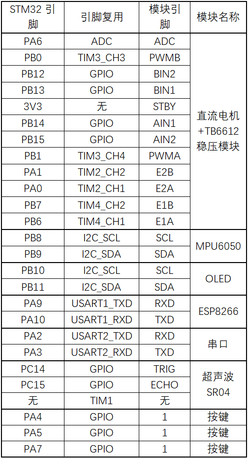

# 电子设计大赛计划书

> 起草：面包的起源

[>>操作指南](guide)

# 项目概况

    电子设计大赛

## 校赛目标

    *两轮平衡车*

## 学习方向(侧重点)

    软件与硬件都需要学：模电、数电  
    软件：stm32hal库、msp系列单片机、openmv、PID算法
    硬件：嘉立创PCB设计、原理图绘制(抄)、焊接、亚克力板雕刻
    附加：soliworks  

### 小提示

    不管软件硬件，上述知识尽可能都会一点，因为软硬件是互通的

# 基础信息与前提

1、选用STM32F103C8T6最小系统板  
2、代码基于STMCUBEMX(HAL库)编写  
3、引脚分配遵循分配表  

## 引脚分配(参考)

